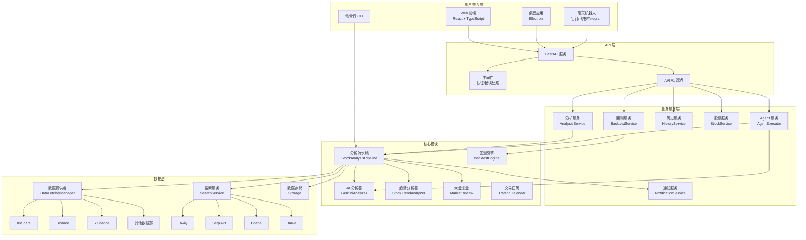
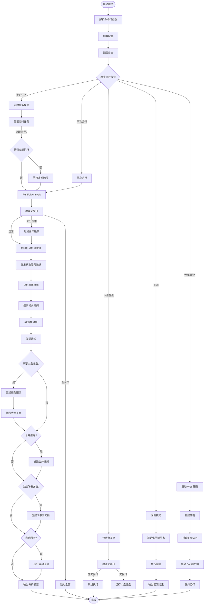
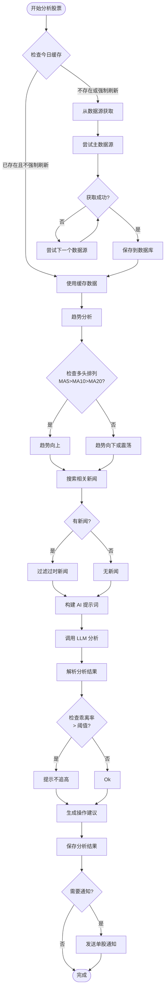

# Daily Stock Analysis 项目架构文档

## 📖 目录
- [项目概述](#项目概述)
- [技术栈](#技术栈)
- [目录结构](#目录结构)
- [核心模块详解](#核心模块详解)
- [代码流程](#代码流程)
- [架构图](#架构图)
- [流程图](#流程图)
- [开发指南](#开发指南)

---

## 项目概述

Daily Stock Analysis 是一个基于 AI 大模型的 A股/港股/美股自选股智能分析系统，具备以下核心功能：

- **AI 分析**：提供决策仪表盘、核心结论、精确买卖点位
- **多维度分析**：技术面、筹码分布、舆情情报、实时行情
- **市场覆盖**：支持 A股、港股、美股及美股指数
- **大盘复盘**：每日市场概览、板块涨跌
- **图片识别**：从自选股截图自动提取股票代码
- **回测验证**：自动评估历史分析准确率
- **Agent 问股**：多轮策略对话，支持 11 种内置策略
- **多渠道推送**：企业微信、飞书、Telegram、钉钉、邮件等
- **Web 界面**：完整的配置管理、任务监控和手动分析功能

---

## 技术栈

| 类别 | 技术 |
|------|------|
| **后端语言** | Python 3.10+ |
| **Web 框架** | FastAPI |
| **前端框架** | React + TypeScript + Vite |
| **AI 模型** | Gemini、OpenAI兼容、DeepSeek、通义千问、Claude、Ollama |
| **行情数据** | AkShare、Tushare、Pytdx、Baostock、YFinance |
| **新闻搜索** | Tavily、SerpAPI、Bocha、Brave |
| **桌面应用** | Electron |
| **容器化** | Docker + Docker Compose |
| **CI/CD** | GitHub Actions |
| **代码规范** | black、isort、flake8 |

---

## 目录结构

```
daily_stock_analysis/
├── .github/                    # GitHub 配置
│   ├── ISSUE_TEMPLATE/         # Issue 模板
│   ├── scripts/                # GitHub 脚本
│   └── workflows/              # GitHub Actions 工作流
├── api/                        # FastAPI 后端 API
│   ├── middlewares/            # 中间件（认证、错误处理）
│   └── v1/                     # API v1 版本
│       ├── endpoints/          # API 端点
│       └── schemas/            # API 数据模型
├── apps/                       # 应用层
│   ├── dsa-desktop/            # 桌面应用（Electron）
│   └── dsa-web/                # Web 前端（React + TypeScript）
├── bot/                        # 聊天机器人
│   ├── commands/               # 机器人命令
│   └── platforms/              # 平台适配器（钉钉、飞书、Discord）
├── data_provider/              # 数据提供者
│   ├── base.py                 # 基类与管理器
│   ├── akshare_fetcher.py      # AkShare 数据源
│   ├── tushare_fetcher.py      # Tushare 数据源
│   ├── yfinance_fetcher.py     # YFinance 数据源
│   └── ...                     # 其他数据源
├── docker/                     # Docker 配置
├── docs/                       # 文档
├── patch/                      # 补丁
├── scripts/                    # 构建和部署脚本
├── sources/                    # 资源文件
├── src/                        # 核心源代码
│   ├── agent/                  # Agent 模块
│   │   ├── skills/             # Agent 技能
│   │   └── tools/              # Agent 工具
│   ├── core/                   # 核心模块
│   │   ├── pipeline.py         # 分析流水线
│   │   ├── market_review.py    # 大盘复盘
│   │   ├── backtest_engine.py  # 回测引擎
│   │   └── trading_calendar.py # 交易日历
│   ├── repositories/           # 数据仓库
│   ├── services/               # 业务服务
│   ├── analyzer.py             # AI 分析器
│   ├── config.py               # 配置管理
│   ├── notification.py         # 通知服务
│   ├── search_service.py       # 搜索服务
│   └── storage.py              # 数据存储
├── strategies/                 # 交易策略配置
├── tests/                      # 测试用例
├── main.py                     # 主入口
├── server.py                   # FastAPI 服务入口
└── requirements.txt            # Python 依赖
```

---

## 核心模块详解

### 1. 主入口模块 (`main.py`)

**文件位置**: `d:\Projects\daily_stock_analysis\main.py`

**职责**:
- 命令行参数解析
- 多模式调度（定时任务、单次运行、Web服务、回测）
- 全局异常处理
- Web 服务启动
- 前端资源自动构建

**主要模式**:
- `--debug`: 调试模式
- `--dry-run`: 仅获取数据不分析
- `--webui`: 启动 Web 管理界面
- `--schedule`: 定时任务模式
- `--market-review`: 仅运行大盘复盘
- `--backtest`: 回测模式

### 2. 核心分析流水线 (`src/core/pipeline.py`)

**文件位置**: `d:\Projects\daily_stock_analysis\src\core\pipeline.py`

**核心类**: `StockAnalysisPipeline`

**职责**:
- 管理整个分析流程
- 协调数据获取、存储、搜索、分析、通知等模块
- 并发控制和异常处理
- 断点续传逻辑

**主要流程**:
1. 获取并保存股票数据
2. 分析股票趋势
3. 搜索相关新闻
4. AI 智能分析
5. 发送通知

### 3. 数据提供者模块 (`data_provider/`)

**文件位置**: `d:\Projects\daily_stock_analysis\data_provider\`

**设计模式**: 策略模式 (Strategy Pattern)

**核心组件**:
- `BaseFetcher`: 抽象基类，定义统一接口
- `DataFetcherManager`: 策略管理器，实现自动切换
- 多个具体 Fetcher 实现（AkShare、Tushare、YFinance 等）

**防封禁策略**:
- 每个 Fetcher 内置流控逻辑
- 失败自动切换到下一个数据源
- 指数退避重试机制

### 4. API 模块 (`api/`)

**文件位置**: `d:\Projects\daily_stock_analysis\api\`

**核心文件**: `api/app.py`

**职责**:
- 提供 RESTful API 服务
- 配置 CORS 跨域支持
- 托管前端静态文件
- 健康检查接口

**API 端点** (`api/v1/endpoints/`):
- `agent.py`: Agent 对话接口
- `analysis.py`: 股票分析接口
- `auth.py`: 认证接口
- `backtest.py`: 回测接口
- `history.py`: 历史记录接口
- `stocks.py`: 股票数据接口
- `system_config.py`: 系统配置接口

### 5. Web 前端模块 (`apps/dsa-web/`)

**文件位置**: `d:\Projects\daily_stock_analysis\apps\dsa-web\`

**技术栈**: React + TypeScript + Vite + Tailwind CSS

**目录结构**:
```
dsa-web/
├── src/
│   ├── api/           # API 调用封装
│   ├── components/    # 组件
│   │   ├── common/    # 通用组件
│   │   ├── history/   # 历史记录组件
│   │   ├── report/    # 报告组件
│   │   ├── settings/  # 设置组件
│   │   └── tasks/     # 任务组件
│   ├── contexts/      # React Context
│   ├── hooks/         # 自定义 Hooks
│   ├── pages/         # 页面
│   ├── stores/        # 状态管理
│   ├── types/         # TypeScript 类型
│   └── utils/         # 工具函数
```

### 6. Agent 模块 (`src/agent/`)

**文件位置**: `d:\Projects\daily_stock_analysis\src\agent\`

**核心组件**:
- `skills/`: Agent 技能（策略执行）
- `tools/`: Agent 工具（数据获取、分析、搜索等）
- `executor.py`: Agent 执行器
- `factory.py`: Agent 工厂
- `llm_adapter.py`: LLM 适配器

**内置策略** (`strategies/`):
- `ma_golden_cross.yaml`: 均线金叉
- `chan_theory.yaml`: 缠论
- `wave_theory.yaml`: 波浪理论
- `bull_trend.yaml`: 多头趋势
- 等 11 种策略

### 7. 通知服务模块 (`src/notification.py`)

**文件位置**: `d:\Projects\daily_stock_analysis\src\notification.py`

**支持的通知渠道**:
- 企业微信 Webhook
- 飞书 Webhook
- Telegram Bot
- 钉钉
- 邮件
- Pushover
- PushPlus
- Server酱
- 自定义 Webhook

### 8. 配置管理模块 (`src/config.py`)

**文件位置**: `d:\Projects\daily_stock_analysis\src\config.py`

**配置来源**:
- 环境变量
- `.env` 文件
- 命令行参数

**主要配置项**:
- AI 模型配置（Gemini、OpenAI 等）
- 通知渠道配置
- 股票列表
- 搜索服务配置
- 数据源配置
- 定时任务配置

---

## 代码流程

### 主流程（完整分析）

```
main.py
  └─> run_full_analysis()
      ├─> 交易日检查
      ├─> StockAnalysisPipeline.run()
      │   ├─> 并发获取股票数据
      │   │   └─> DataFetcherManager.get_daily_data()
      │   ├─> 分析股票趋势
      │   ├─> 搜索新闻
      │   ├─> AI 分析
      │   │   └─> GeminiAnalyzer.analyze()
      │   └─> 发送通知
      │       └─> NotificationService.send()
      ├─> run_market_review() [可选]
      ├─> 生成飞书云文档 [可选]
      └─> 自动回测 [可选]
```

### API 请求流程

```
HTTP 请求
  └─> api/app.py (FastAPI)
      └─> api/v1/endpoints/
          ├─> analysis.py
          │   └─> AnalysisService
          │       └─> StockAnalysisPipeline
          ├─> backtest.py
          │   └─> BacktestService
          ├─> history.py
          │   └─> HistoryService
          └─> ...
```

### Agent 对话流程

```
用户提问
  └─> AgentExecutor
      ├─> 解析用户意图
      ├─> 选择策略
      ├─> 调用工具
      │   ├─> DataTools (获取行情)
      │   ├─> AnalysisTools (技术分析)
      │   └─> SearchTools (新闻搜索)
      ├─> 思考推理
      └─> 生成回答
```

---

## 架构图



---

## 流程图

### 完整分析流程



### 股票分析单股流程



---

## 开发指南

### 环境配置

1. 克隆项目
```bash
git clone https://github.com/ZhuLinsen/daily_stock_analysis.git
cd daily_stock_analysis
```

2. 安装 Python 依赖
```bash
pip install -r requirements.txt
```

3. 配置环境变量
```bash
cp .env.example .env
# 编辑 .env 文件，配置必要的 API Key
```

4. 安装前端依赖（可选，如需开发 Web UI）
```bash
cd apps/dsa-web
npm install
```

### 开发命令

```bash
# 运行完整分析
python main.py

# 仅 Web 服务
python main.py --webui-only

# Web 服务 + 分析
python main.py --webui

# 调试模式
python main.py --debug

# 仅大盘复盘
python main.py --market-review

# 回测
python main.py --backtest
```

### 代码规范

项目使用以下工具进行代码格式化和检查：

- `black`: 代码格式化
- `isort`: 导入排序
- `flake8`: 代码风格检查

运行检查：
```bash
black .
isort .
flake8 .
```

### 测试

```bash
# 运行所有测试
pytest tests/

# 运行语法检查
./test.sh syntax
```

### 贡献

详见 [CONTRIBUTING.md](docs/CONTRIBUTING.md)

---

## 附录

### 主要文件索引

| 文件 | 说明 |
|------|------|
| `main.py` | 主入口程序 |
| `server.py` | FastAPI 服务入口 |
| `src/core/pipeline.py` | 分析流水线核心 |
| `src/analyzer.py` | AI 分析器 |
| `src/config.py` | 配置管理 |
| `src/notification.py` | 通知服务 |
| `data_provider/base.py` | 数据提供者基类 |
| `api/app.py` | FastAPI 应用工厂 |
| `apps/dsa-web/src/App.tsx` | 前端应用入口 |

### 环境变量参考

详见 `.env.example` 和 [完整指南](docs/full-guide.md)

---

**文档版本**: 1.0  
**最后更新**: 2026-03-05  
**维护者**: 项目团队
